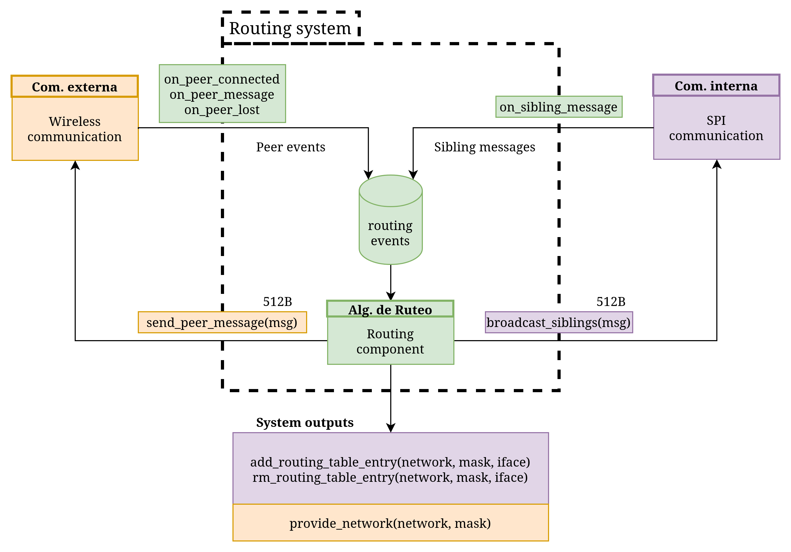
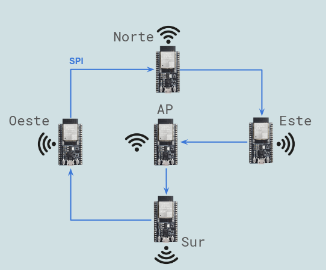
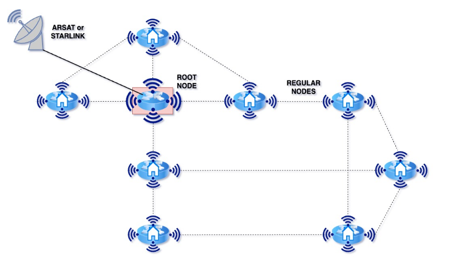
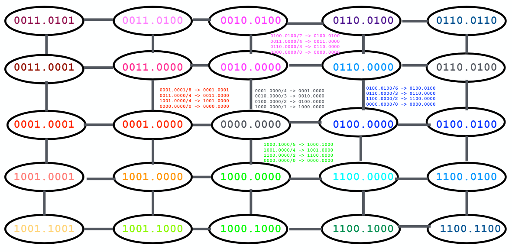
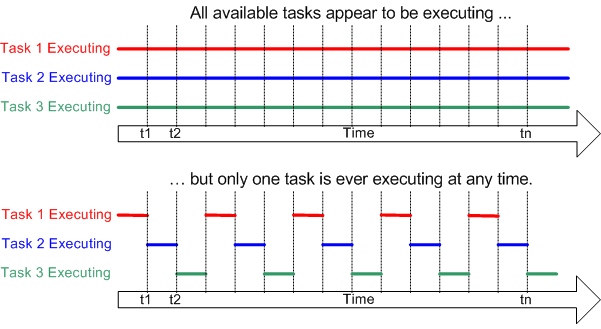
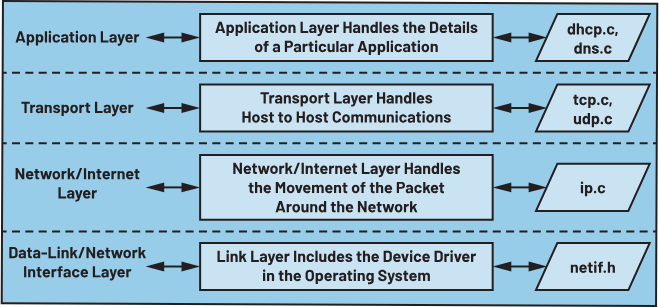

# ComNetAR — Lightweight Embedded Mesh Networking Architecture for ESP32

## Overview

ComNetAR is an experimental distributed networking platform designed for low-resource embedded systems using ESP32 microcontrollers.

The project explores the implementation of a lightweight mesh-oriented communication architecture capable of operating on constrained hardware without requiring complex routing tables, high-performance processors, or large operating systems.

Instead of relying on traditional mesh routing approaches designed for Linux-based devices or high-capacity embedded systems, ComNetAR focuses on minimizing:

- memory usage,
- routing state,
- processing overhead,
- communication complexity.

The system is designed around modular communication components that can operate efficiently on microcontrollers while still supporting:

- packet forwarding,
- telemetry,
- local inter-module communication,
- distributed wireless connectivity.

---

# Architecture

Each node in the system is composed of three main modules:

1. Ring Link  
2. Wireless  
3. Routing  

These modules interact together to provide internal communication, wireless connectivity, and distributed packet propagation.

<p align="center">
  
</p>

---

## Ring Link Module

The Ring Link module provides high-speed local communication between ESP32 boards inside the same node using SPI connections arranged in a ring topology.

Each ESP32 simultaneously operates as:

- SPI master toward the next board,
- SPI slave toward the previous board.

This creates a bidirectional circular communication structure where packets can circulate across all internal boards with minimal overhead.

The Ring Link layer is responsible for:

- local packet transport,
- synchronization between boards,
- internal message forwarding,
- error detection,
- inter-module communication.

Unlike traditional bus architectures, the ring topology allows the system to scale modularly while avoiding centralized communication bottlenecks.

<p align="center">
  
</p>

---

## Wireless Module

The Wireless module handles communication between independent nodes through WiFi.

One ESP32 inside the node acts as the external Access Point (AP), allowing the node to communicate with:

- other mesh nodes,
- monitoring systems,
- external IP networks.

This module manages:

- wireless packet transmission,
- dynamic connectivity,
- recovery mechanisms,
- network interface integration using lwIP.

- <p align="center">
  
</p>

---

## Routing Module

The Routing module implements a lightweight forwarding mechanism optimized for constrained embedded environments.

Traditional mesh routing protocols often require:

- large routing tables,
- periodic topology exchanges,
- continuous route maintenance,
- significant memory consumption.

ComNetAR instead explores simplified routing strategies inspired by topological addressing approaches such as **ANTop** (Adjacent Network Topology).

In this model, part of the network topology is embedded directly into the node addressing scheme.

<p align="center">
  
</p>

This approach allows the system to:

- reduce routing state,
- simplify forwarding decisions,
- minimize memory usage,
- improve scalability on constrained hardware.

The routing layer therefore focuses on lightweight packet propagation rather than maintaining complete global topology knowledge.

---

# System Goals

The project was developed as part of a research effort focused on validating the feasibility of mesh-oriented distributed communication systems running on low-cost embedded hardware.

The primary goals are:

- modular node architecture,
- low computational overhead,
- reduced routing complexity,
- fault-tolerant communication,
- compatibility with resource-constrained IoT devices.

---

# Hardware Platform

The project currently targets:

- Espressif ESP32-DevKitC v4
- ESP32-WROOM-32 module

The ESP32 platform was selected because it provides:

- integrated WiFi,
- dual-core execution,
- DMA-capable SPI peripherals,
- FreeRTOS support,
- native integration with ESP-IDF and lwIP.

<p align="center">
  
</p>

---

# Software Stack

The system is built using:

- ESP-IDF v5.1.2
- FreeRTOS
- lwIP

---

## FreeRTOS

FreeRTOS is used to organize the system into concurrent tasks distributed across the ESP32 dual-core architecture.

This enables:

- concurrent packet processing,
- task prioritization,
- synchronization primitives,
- deterministic scheduling.

<p align="center">
  
</p>

---

## lwIP

The networking layer is implemented using lwIP, a lightweight TCP/IP stack optimized for embedded systems.

The stack provides:

- IPv4/IPv6 support,
- IP forwarding,
- UDP/TCP communication,
- integration with wireless interfaces.

<p align="center">
  
</p>

---

# Internal Ring Topology

The internal node architecture supports between 2 and 5 ESP32 boards connected in a physical SPI ring.

Possible configurations include:

- 2-board minimal topology,
- 3–4 board intermediate topologies,
- 5-board full topology.

Each board assumes a specific role:

- North
- South
- East
- West
- Access Point (AP)

The AP board acts as the gateway between the internal ring and external wireless communication.

---

# SPI Physical Connections

```text
Master Device          Slave Device
-------------         -------------
GPIO 23 (MOSI)  --->  GPIO 13 (MOSI)
GPIO 18 (SCLK)  --->  GPIO 14 (SCLK)
GPIO 5  (CS)    --->  GPIO 15 (CS)
```

---

# Role Configuration Pins

```text
CONFIG_PIN_0 -> GPIO 22
CONFIG_PIN_1 -> GPIO 21
CONFIG_PIN_2 -> GPIO 16
```

These pins determine the role assigned to each ESP32 inside the node.

---

# Build Environment

## Requirements

Before building the project, install:

- ESP-IDF v5.1.2
- Python 3.x
- Git
- CMake
- Ninja

Official ESP-IDF installation guide:

https://docs.espressif.com/projects/esp-idf/en/v5.1.2/esp32/get-started/

---

# Installation

Clone the repository:

```bash
git clone https://github.com/clrvyntx/i4a.git
cd i4a
```

---

## ESP-IDF Setup

### Linux/macOS

```bash
mkdir -p ~/esp
cd ~/esp

git clone -b v5.1.2 --recursive https://github.com/espressif/esp-idf.git

cd esp-idf
./install.sh

source export.sh
```

### Windows

Use the official ESP-IDF Tools Installer:

https://docs.espressif.com/projects/esp-idf/en/v5.1.2/esp32/get-started/windows-setup.html

---

# Build Project

From the project root:

```bash
idf.py build
```

---

# Flash Firmware

```bash
idf.py -p PORT flash
```

Example:

```bash
idf.py -p /dev/ttyUSB0 flash
```

or on Windows:

```bash
idf.py -p COM3 flash
```

---

# Serial Monitor

```bash
idf.py -p PORT monitor
```

Exit monitor:

```text
CTRL + ]
```

---
