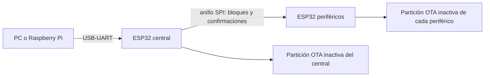

# Actualización del nodo desde el USB del central

El mismo `main.bin` se distribuye a los ESP32 del nodo por el anillo SPI. Los roles
siguen determinados por los pines de configuración. El USB de la DevKitC es un
puente USB-UART: durante las actualizaciones normales se habla con la aplicación
del central, que utiliza las funciones OTA de ESP-IDF en cada placa.



## Primera instalación: una vez por placa

**Todas las placas necesitan este firmware, el bootloader con rollback y la nueva
tabla de particiones.** El firmware anterior no puede recibir la actualización por
SPI. Flashear solamente el central no habilita las demás placas; tampoco alcanza
con `app-flash`, porque no instala el bootloader ni la tabla.

1. Comprobar la flash física de **cada placa**, desde una terminal ESP-IDF:

   ```sh
   python -m esptool --chip esp32 --port COM3 flash_id
   ```

2. La configuración predeterminada utiliza **4 MiB** y `app/partitions.csv`.
   Hay dos particiones de aplicación de `0x1f0000` bytes (2.031.616 bytes) cada una,
   más NVS, datos OTA y PHY. Para placas de **2 MiB**, ejecutar
   `idf.py -C app menuconfig`, seleccionar flash de 2 MB en “Serial flasher config”
   y `partitions_2mb.csv` en “Partition Table / Custom partition CSV file”. Cada
   aplicación queda limitada a `0xf0000` bytes (983.040 bytes). El build comprueba
   si la imagen entra. No seleccionar 4 MB si la memoria física es menor.

3. Compilar y flashear **cada ESP32 por separado**, cambiando el puerto:

   ```sh
   idf.py -C app build
   idf.py -C app -p COM3 flash
   ```

   El proyecto CMake está en `app/`. La configuración se genera desde
   `components/sdkconfig.defaults`; `app/sdkconfig` es local y no se versiona.
   Esta implementación usa ESP-IDF **5.4.1**. El README histórico menciona 5.1.2;
   esa versión no fue validada para este cambio. Si ya existe un `sdkconfig` de
   otra compilación, los defaults no reemplazan sus valores: configurar flash,
   particiones y rollback con `menuconfig` antes de flashear.

4. Armar el anillo cerrado, alimentar todas las placas y conectar el USB del
   **central**. Esperar a que termine el arranque (habitualmente varias decenas de
   segundos). Cerrar el monitor serial antes de usar el cargador. No mantener
   presionado BOOT: el cargador requiere que la aplicación esté ejecutándose.

No se requieren nuevos cables entre las placas. Un anillo interrumpido o una placa
sin alimentación impide la distribución, aunque se quite ese rol del comando.
La migración conserva la región NVS existente; cambia las regiones de PHY y de
aplicación. Las actualizaciones posteriores solo escriben aplicaciones y datos OTA.

## Consultar y actualizar

Desde la raíz del repositorio, con Python 3.9 o posterior:

```sh
python -m pip install -r gateway/requirements-ota.txt
python gateway/flash_node.py --port COM3 --roles center,north,south,east,west --status
python gateway/flash_node.py --port COM3 --roles center,north,south,east,west --image app/build/main.bin
```

`--roles` es obligatorio: indicar **todos los roles físicamente presentes**, una
vez cada uno. Por ejemplo, para un nodo mínimo usar `--roles center,north`.
Los roles omitidos no se actualizan; no hay descubrimiento automático de placas
adicionales ni detección de dos placas con el mismo rol. Una placa requerida que
no responde impide iniciar la escritura. La configuración root/home del central
no cambia el nombre del rol: siempre es `center`.

Enviar exclusivamente el binario de aplicación `main.bin`, nunca una imagen
fusionada, el bootloader ni la tabla de particiones. Todas las placas reciben el
mismo binario. Mantener el mismo mapa de particiones y compatibilidad del protocolo
SPI/reset al compilar futuras versiones.

El protocolo comparte UART0 con los logs, a **115200 baud** por defecto. El parser
ignora logs y tramas inválidas. `--baud` debe coincidir con el baud de consola
configurado en el firmware; no negocia velocidades. El programa evita pulsar
intencionalmente DTR/RTS, aunque algunos adaptadores pueden reiniciar al abrir el
puerto. Si ocurre, esperar el arranque y repetir.

Para diagnosticar un fallo, agregar `--verbose`: muestra los comandos, los ACK
por rol y los logs del firmware en stderr. Los errores de timeout identifican
la operación (`BEGIN`, `DATA`, etc.), secuencia y offset. Por ejemplo:

```sh
python gateway/flash_node.py --port COM5 --roles center,north,south,east,west --status --verbose
```

Cada ACK `INFO` también muestra `STATUS` con partición actual, hash ELF, sesión y
`pending_verify`, aun si otro rol no responde. Durante la verificación de arranque
se imprime el hash esperado y se identifica cada rol que continúa pendiente,
ejecuta otro hash o sigue en su partición anterior. Las esperas de ACK de esa
verificación usan el tiempo restante de `--boot-timeout`.

El cargador devuelve código 0 únicamente después de consultar todos los roles y
verificar que ejecutan el hash ELF esperado, desde la nueva partición, con el
arranque confirmado. Los tiempos se ajustan con `--timeout`, `--retries` y
`--boot-timeout`. La carga a 115200 baud tarda varios minutos; incluye confirmaciones
por placa y no tiene todavía una medición de rendimiento en hardware.

## Secuencia y recuperación

1. `INFO`: comprobar presencia, capacidad de flash y estado de cada placa.
2. `BEGIN`: reservar la partición inactiva y anunciar tamaño y SHA-256 del archivo.
   El borrado es incremental (`OTA_WITH_SEQUENTIAL_WRITES`): se borran sectores
   al escribir `DATA`, en lugar de borrar toda la imagen durante `BEGIN`.
3. `DATA`: enviar bloques de hasta 448 bytes con offset, sesión, secuencia y CRC32.
   No se envía el siguiente bloque hasta tener confirmación de todos los roles.
4. `END`: comparar SHA-256 y validar la imagen con `esp_ota_end()` en cada placa.
5. `SELECT`: seleccionar la nueva partición; esperar todas las confirmaciones.
6. `REBOOT`: volver a comprobar que todas las placas están listas. Los periféricos
   no se reinician desde el callback: mantienen el anillo activo para los ACK.
   El central reinicia y su broadcast de reset habitual reinicia a los periféricos.
7. Verificar arranque. Una imagen pendiente tiene 90 segundos para terminar la
   inicialización y llamar a `esp_ota_mark_app_valid_cancel_rollback()`. Si no lo
   hace, se provoca un reinicio y el bootloader intenta volver a la versión previa.
8. Recuperación automática: cada placa que arrancó una imagen pendiente y la
   confirmó hace un reinicio local alrededor de los 120 segundos desde ese
   arranque. Usa `rm_restart_local()` y no necesita un broadcast por el anillo.
   En el siguiente arranque la imagen ya está validada, por lo que no se programa
   otro reinicio. El startup habitual del `reset_manager` vuelve a sincronizar
   el nodo. El plazo de verificación del cargador es de 240 segundos por defecto.

Esta recuperación atiende el caso observado: la imagen queda confirmada, pero
el anillo deja de responder durante el primer arranque OTA y vuelve a responder
al reiniciar. Automatiza esa recuperación; no demuestra ni elimina la causa
interna de la pérdida de comunicación. Se espera la ventana de confirmación
antes de reiniciar para no forzar el rollback de otra placa que siga arrancando.
No se adelanta la confirmación de la imagen.

`INFO` expone `recovery_pending=1` durante ese primer arranque, incluso después
de `pending_verify=0`. Mientras tanto se rechaza otra carga. El cargador solo
declara éxito cuando todos los roles tienen ambas banderas en cero, el hash
esperado y la partición nueva. No cortar alimentación durante la espera; pueden
verse timeouts `INFO` y un segundo log de boot antes del resultado final.
Usar el cargador Python actualizado: admite los INFO antiguos de 50 bytes y los
nuevos de 51; el cargador anterior no admite el nuevo tamaño.

Los reintentos conservan exactamente la sesión, secuencia y contenido. Cada placa
guarda su última respuesta satisfactoria: perder un ACK no implica escribir el
mismo bloque dos veces. Los callbacks del anillo solo encolan mensajes; la escritura
de flash y las esperas se ejecutan en tareas separadas.

El central envía cada operación a **un periférico por vez**, espera su ACK y
recién entonces sigue con el próximo; procesa su propia flash al final. En SPI
usa una máscara `center + periférico` y devuelve al host los ACK con la máscara
completa solicitada. Esto conserva el protocolo v1 y evita que varias placas
escriban o borren flash al mismo tiempo mientras circulan los ACK. El plazo de
15 segundos para recibir los ACK periféricos se comparte entre todos los roles.

Antes de `REBOOT`, un error hace que el cargador envíe `ABORT`: cancela la escritura
y restaura la selección del firmware que está ejecutándose. Una sesión abandonada
también se cancela después de **120 segundos sin comandos válidos de actualización**.
`INFO` no prolonga ese plazo. No se reanuda una transferencia parcial tras reiniciar;
se vuelve a enviar desde el principio.

Si una cancelación no pudo confirmarse, mantener las placas alimentadas durante al
menos 120 segundos y consultar `--status` antes de reiniciar. Los estados son
`0=idle`, `1=receiving`, `2=ready`, `3=selected`; `pending_verify=1` indica un arranque
aún no confirmado. Un fallo persistente al restaurar los datos OTA requiere
recuperación por USB.

### Si `--status` funciona, pero la carga pierde los ACK al comenzar

Si aparecen los cinco roles en `phase=0`, con capacidad suficiente, pero la carga
falla antes del primer porcentaje, falló `BEGIN` o el primer `DATA`. En esa etapa
no se ha enviado `SELECT`, por lo que no se eligió una nueva aplicación para arrancar.
El mensaje genérico del cargador anterior no permite distinguir esas dos operaciones.

La implementación anterior enviaba las operaciones simultáneamente a todas las
placas y borraba la región completa de la imagen durante `BEGIN`. Las operaciones
de flash suspenden tareas e interrupciones normales del ESP32, lo que puede
interrumpir la recepción y el reenvío SPI y perder ACK. Que `INFO` funcione antes
de la carga no descarta este problema: `INFO` no escribe flash. Véanse las
[restricciones de concurrencia de ESP-IDF](https://docs.espressif.com/projects/esp-idf/en/v5.4.1/esp32/api-reference/peripherals/spi_flash/spi_flash_concurrency.html).
La pérdida de ACK por sí sola no confirma la causa; también hacen falta los logs
y una prueba física para descartar reinicios o fallos del enlace.

1. Tras el error, mantener todo encendido al menos 120 segundos y repetir
   `--status`. Si siguen faltando los periféricos y el intento falló **antes del
   primer porcentaje**, apagar y encender el nodo completo, esperar a que termine
   el arranque y consultar de nuevo. Para fallos posteriores a `SELECT`, seguir
   las precauciones de recuperación indicadas arriba.
2. Instalar esta corrección por USB en cada placa, usando el puerto correspondiente:

   ```sh
   idf.py -C app build
   idf.py -C app -p COM5 flash
   ```

   Repetir `flash` para las cinco placas. Poner un `main.bin` corregido en el
   comando OTA no modifica el receptor que ya está ejecutándose y falla al cargar.
3. Reconectar el central, cerrar el monitor serial, esperar el arranque y comprobar
   los cinco roles con `--status --verbose`. Si siguen faltando roles después del
   reinicio, revisar los logs de arranque, alimentación y continuidad SPI antes de
   volver a cargar. Con todos los roles en reposo:

   ```sh
   python gateway/flash_node.py --port COM5 --roles center,north,south,east,west --image app/build/main.bin --verbose
   ```

### Si `SELECT` y `REBOOT` terminan, pero no se verifica el arranque

Los ACK satisfactorios de `END`, `SELECT` y `REBOOT` confirman que se verificó la
imagen, se seleccionó el próximo arranque y se aceptó el reinicio. No confirman
por sí solos que la nueva aplicación haya completado la inicialización en cada
placa. Del mismo modo, `phase=0` solo describe una sesión OTA inactiva.

Para declarar éxito, el cargador exige una consulta completa con los cinco roles
en reposo, el hash ELF del archivo enviado, una partición distinta de la anterior
y `pending_verify=0`, además de `recovery_pending=0` en el firmware actual.
El firmware confirma el arranque al finalizar su
inicialización; si no lo confirma en 90 segundos, intenta reiniciar para permitir
el rollback. Un timeout del host por sí solo no demuestra que haya ocurrido rollback.

Si primero llegan ACK `INFO` y después dejan de llegar, conservar el último
`STATUS` y el motivo `Boot not confirmed`. En versiones anteriores del cargador,
el verbose solo mostraba la fase y ocultaba esos datos; no es posible reconstruir
el hash o `pending_verify` a partir de aquel registro.

Además, la versión actual del coordinador consulta los periféricos antes de
responder por el central. Si no recibe el primer ACK o se bloquea el envío SPI,
puede faltar también la respuesta del central aunque su aplicación siga activa.
Por tanto, `No ACK from ... center` no prueba por sí solo una desconexión USB.

Con el firmware actual, esperar primero el resultado final del cargador: la
recuperación local es automática aunque haya dejado de responder el anillo.
Si la verificación termina fallando (o se usa un firmware anterior):

1. Mantener las placas encendidas 120 segundos desde el último comando. Si siguen
   sin responder, apagar y encender **todo el nodo**, esperar el arranque y ejecutar
   solamente la consulta:

   ```sh
   python gateway/flash_node.py --port COM5 --roles center,north,south,east,west --status --verbose
   ```

2. Comparar partición, hash y `pending_verify` de cada rol. Puede haber una mezcla
   de aplicaciones nuevas y anteriores; confirmar las cinco antes de considerar
   terminada la actualización o iniciar otra carga.
3. Si sigue sin haber respuestas, capturar el arranque por UART para diagnosticar
   inicialización, reinicios y continuidad del anillo. Los defaults del proyecto tienen
   los logs de aplicación deshabilitados (`CONFIG_LOG_DEFAULT_LEVEL=0`); los logs
   del bootloader no muestran todo lo que ocurre después de `app_main`.

Los cambios de diagnóstico del cargador se usan inmediatamente en Python y no
requieren recompilar ni instalar otro firmware.

### Capturar las trazas de arranque del firmware

El firmware incorpora marcas `I4ABOOT` por UART, visibles incluso con los logs
de aplicación deshabilitados. Estas marcas sí requieren compilar e instalar la
imagen nueva. Se imprimen alrededor de la inicialización del nodo, routing,
Wi-Fi y confirmación OTA, sin adelantar la confirmación ni cambiar su plazo.

Antes de cargar, recuperar el nodo como se describe arriba y comprobar que los
cinco roles respondan con `phase=0`, `session=0`, `pending_verify=0` y
`recovery_pending=0`.
Cerrar cualquier monitor serial y, desde la raíz del proyecto, guardar el
intento completo en PowerShell:

```powershell
python -u gateway/flash_node.py --port COM5 --roles center,north,south,east,west --image app/build/main.bin --verbose 2>&1 | Tee-Object -FilePath ota-diagnostico.log
```

El cargador muestra las marcas como `device: I4ABOOT ... stage=...`. En COM5 se
observan las trazas del central; las de cada periférico salen por su propia UART
y no se reenvían por el anillo. `role=255` al principio indica que todavía no se
leyó el rol de la placa.

- Una marca `*.begin` sin su correspondiente `*.end` identifica la última etapa
  observada; conservar también cualquier mensaje de fallo o reinicio posterior.
- `confirm.write_begin` indica que se intentó confirmar la imagen;
  `confirm.write_ok` indica que la API de confirmación devolvió éxito.
- `watchdog.pending_restart` indica que se alcanzó el plazo de 90 segundos con
  el arranque todavía pendiente y se va a solicitar un reinicio.
- `app_main.ready` indica que finalizó la inicialización normal de esa placa.
- `recovery.local_restart` indica el reinicio local automático de recuperación;
  el próximo arranque debe mostrar `boot.not_pending` y no repetir la recuperación.

Conservar el archivo completo y repetir `--status --verbose` después del
intento. Una marca satisfactoria del central no sustituye la comprobación de los
cinco roles. Si faltan respuestas, seguir la recuperación anterior antes de
repetir la carga. Las trazas ayudan a ubicar el fallo; no constituyen una
corrección de su causa.

### Si Windows informa `ClearCommError failed` o `Write timeout`

`ClearCommError failed (..., 31)` indica que Windows no pudo consultar el
dispositivo serial. El [error Win32 31 (`ERROR_GEN_FAILURE`)](https://learn.microsoft.com/en-us/windows/win32/debug/system-error-codes--0-499-)
significa que un dispositivo conectado al sistema no funciona. Aunque Python lo
muestre como `PermissionError(13)`, ese código no demuestra que falten permisos
de administrador. Mover o desconectar el cable USB puede provocar este fallo;
el log por sí solo no identifica si fue el cable, la alimentación o el controlador.

Si después falla `ABORT` con `Write timeout`, la cancelación no pudo confirmarse
por esa conexión. El cargador conserva el error original, la operación, el offset
y los roles cuyos ACK recibió; un error al cerrar el puerto tampoco oculta ese
diagnóstico. No reabre automáticamente el puerto ni reanuda bloques de una sesión
que podría haber perdido su estado durante una desconexión.

Si el fallo ocurrió durante `DATA`, todavía no se envió `SELECT` y esta carga no
seleccionó una nueva imagen de arranque. Para repetirla:

1. Asegurar el cable y mantener las placas alimentadas al menos **120 segundos
   desde el fallo** para que expire la sesión. Si el USB alimenta una placa,
   desconectarlo también puede reiniciarla; esperar nuevamente el arranque.
2. Cerrar monitores seriales y comprobar el puerto disponible:

   ```sh
   python -m serial.tools.list_ports -v
   python gateway/flash_node.py --port COM5 --roles center,north,south,east,west --status --verbose
   ```

   Si Windows asignó otro COM, usar ese puerto. Si COM5 sigue inaccesible,
   reconectar el USB después de la espera y volver a comprobarlo.
3. Con los cinco roles en `phase=0`, `session=0` y `pending_verify=0`, repetir
   `--image app/build/main.bin --verbose`. La transferencia comienza desde cero;
   este fallo durante `DATA` no requiere reinstalar el firmware por USB.

Si vuelve a ocurrir con el cable inmóvil, probar otra conexión USB y revisar la
alimentación y el controlador del puente USB-UART. Aumentar `--timeout` solo cambia
la espera de ACK; no recupera un puerto que Windows dejó de poder utilizar.
Si la pérdida ocurrió durante `SELECT` o `REBOOT`, el estado de arranque puede
haber cambiado: conservar la espera y verificar todos los roles con `--status`.

**El commit no es atómico entre placas.** Un corte de energía durante `SELECT` o
el reinicio puede dejar versiones distintas, y el rollback es individual, no del
nodo completo. El programa comprueba el resultado, pero no implementa un registro
distribuido persistente para recuperar automáticamente esa situación. Si ambas
versiones mantienen el protocolo, volver a cargar el nodo; si no, recuperar las
placas afectadas individualmente por USB. La confirmación de arranque comprueba
la inicialización del nodo, no garantiza la calidad de los enlaces ni diagnostica
todas las funcionalidades de la nueva aplicación.

Las particiones y el rollback siguen el mecanismo oficial de
[OTA de ESP-IDF 5.4.1](https://docs.espressif.com/projects/esp-idf/en/v5.4.1/esp32/api-reference/system/ota.html).

## Raspberry Pi y futura actualización a través de la red

El cargador funciona en una Raspberry Pi cuando su USB está conectado directamente
al central del nodo que se quiere actualizar:

```sh
python3 gateway/flash_node.py --port /dev/ttyUSB0 --roles center,north,south,east,west --image main.bin
```

Si ese central es el root, este comando actualiza **el nodo root**, no todos los
nodos de la malla. Puede ejecutarse por SSH en la Raspberry Pi.

La entrada para la futura actualización por red es `node_ota_exchange()` en
`components/integration/node_ota/include/node_ota/node_ota.h`. Es independiente
del puerto serial y coordina los mismos mensajes y confirmaciones por SPI. Un
futuro servicio en el central de cada nodo podrá recibir las solicitudes desde la
Raspberry Pi a través del root, llamar a esta función desde su propia tarea y
devolver los ACK. El emisor Python separa `NodeUpdater` de `SerialTransport` para
agregar ese transporte sin cambiar la secuencia de actualización.

**Todavía no se implementa el transporte OTA entre nodos por WiFi/IP.** Para esa
etapa faltan el servicio de red, la selección/direccionamiento del nodo remoto,
autenticación y autorización de actualizaciones, y las pruebas de rutas desde el
gateway. CRC32 y SHA-256 detectan corrupción; no autentican al emisor ni la imagen.
No se habilitó un puerto de actualización remoto sin autenticación.

Un servicio nuevo debe serializar toda la sesión (no intercalar dos cargadores),
vaciar su respuesta antes de reiniciar y llamar a `esp_restart()` para `REBOOT`
solo si `node_ota_exchange()` devolvió `ESP_OK`. El estado de cada receptor impide
que otra sesión reemplace una actualización en curso.

## Formato del protocolo v1

USB: `I4AOTA:` seguido de la trama binaria en hexadecimal y `\n`. Las respuestas
pueden estar rodeadas de logs. En SPI se transmite directamente la trama binaria
mediante el componente `RS_NODE_OTA=7` de `ring_share`.

| Offset | Campo | Tamaño |
| --- | --- | --- |
| 0 | Versión = 1 | 1 byte |
| 1 | Operación 1..7; respuesta = operación OR 0x80 | 1 byte |
| 2 | Máscara de roles (N=1, S=2, E=4, W=8, central=16) | 1 byte |
| 3 | Emisor (host=255, respuesta=rol 0..4) | 1 byte |
| 4 | Identificador de sesión no nulo para mutaciones | uint32 LE |
| 8 | Secuencia | uint32 LE |
| 12 | Offset solicitado / bytes escritos en respuesta | uint32 LE |
| 16 | Longitud del payload (máximo 448) | uint16 LE |
| 18 | Payload | variable |
| final | CRC32 IEEE del header y payload, compatible con zlib.crc32 | uint32 LE |

`BEGIN` lleva tamaño uint32 LE y SHA-256 (32 bytes); `DATA` contiene el bloque.
`INFO`, `END`, `SELECT`, `ABORT` y `REBOOT` no llevan payload. `END`, `SELECT` y
`REBOOT` llevan el tamaño completo en offset. Las respuestas contienen código
ESP-IDF uint32 LE (0=OK) y estado uint8. `INFO` agrega capacidad uint32, dirección
de partición actual uint32, hash ELF de 32 bytes, sesión activa uint32 y bandera
pending_verify uint8 y recovery_pending uint8 (byte 50). La respuesta INFO actual
tiene 51 bytes; las versiones anteriores tienen 50 y no incluyen recuperación
automática. Se esperan ACK por cada rol solicitado.

## Validación

```sh
python -m unittest discover -s tests -p "test_*.py" -v
```

Las pruebas Python inyectan pérdidas de ACK, placas ausentes, rechazo de escritura,
fallos de selección y rollback observado al verificar el arranque. Las pruebas C
de `tests/native/receiver_test.c` usan el receptor real con flash y proveedor SHA
simulados, para comprobar offsets, duplicados, errores, cancelación y expiración.
`tests/native/exchange_test.c` ejecuta el coordinador real sobre un anillo simulado:
comprueba operaciones por placa, máscaras de ACK, respuestas antiguas, timeout,
reintentos y rechazo de reinicio ante un ACK con error.
También verifica el reinicio local sin respuestas del anillo, el rechazo de otra
carga mientras se espera ese reinicio, la ausencia de bucles y el plazo de rollback
ante un fallo de confirmación. Python simula un anillo que deja de responder hasta
el reinicio y exige que la recuperación termine en todos los roles.
Para ejecutarlas con un compilador C nativo:

```sh
python tests/run_native_ota.py --cc cc
# En Windows, usar la ruta a tcc.exe (TinyCC de 64 bits) como --cc.
```

El runner también compara las tramas C/Python y rechaza tramas corruptas y truncadas.

### Antecedente de prueba física de recuperación (2026-09-30)

Esta prueba se realizó en la rama de desarrollo del fork, antes de separar OTA
sobre upstream. Es un antecedente del mecanismo de recuperación; la prueba de
la rama aislada se describe a continuación.

El registro `ota-recuperacion.log`, capturado por COM5 con los cinco roles,
termina con `Verified: every selected role booted and confirmed the new firmware.`
Se cargó una imagen de 895568 bytes, con hash ELF
`4b67334272a25933cf9e1f7af6e0d595186d556efef92a5a03378189fda74652`.

El central confirmó la imagen a los 28302 ms. Luego se perdieron las respuestas
INFO, pero a los 120002 ms apareció `recovery.local_restart`, seguido de un
reinicio por software y `boot.not_pending`. La consulta INFO seq=2012 recibió
respuesta de north, south, east, west y center: todos en `0x20000` (antes estaban
en `0x210000`), con el hash esperado, `phase=0`, `session=0`, `pending_verify=0`
y `recovery_pending=0`.

Esta ejecución validó la recuperación automática y la verificación final de
los cinco roles con aquel firmware. No identifica la causa interna del bloqueo
ni demuestra estabilidad prolongada: el log finaliza tras la consulta satisfactoria.

### Prueba física de la rama OTA sobre upstream (2026-09-30)

El registro `ota-upstream.log` valida una carga completa por COM5 en los cinco
roles de la rama `feat/node-ota` (commit `ecd1050`). El hash ELF esperado y
reportado por todas las placas es
`7c79d76160ad49eea03c8a900f8b5e8dcf506a25e5103029ce1c98a197ecb841`.

El central confirmó la imagen a los 32292 ms y ejecutó `recovery.local_restart`
a los 120002 ms. La consulta INFO seq=1809, después del nuevo arranque, recibió
los cinco roles en `0x20000`, con `phase=0`, `session=0`, `pending_verify=0` y
`recovery_pending=0`. El cargador terminó con
`Verified: every selected role booted and confirmed the new firmware.`

Este registro no contiene timeouts `Boot INFO failed` ni intentos 2/3 o 3/3.
Por tanto, valida la actualización y el reinicio automático en esta rama, pero
no reproduce el bloqueo observado en el fork ni demuestra que el reinicio sea
necesario en todos los casos. No establece la causa de aquel bloqueo ni valida
estabilidad prolongada o todas las funciones de routing y modos.

Antes de usarlo en campo, completar las pruebas con el nodo físico: consulta de todos los roles,
carga completa, desconexión del USB durante DATA, pérdida de alimentación durante
la activación y arranque de una imagen que falle antes de confirmarse. Las pruebas
en PC y la compilación no validan los tiempos SPI/UART ni la recuperación eléctrica.
